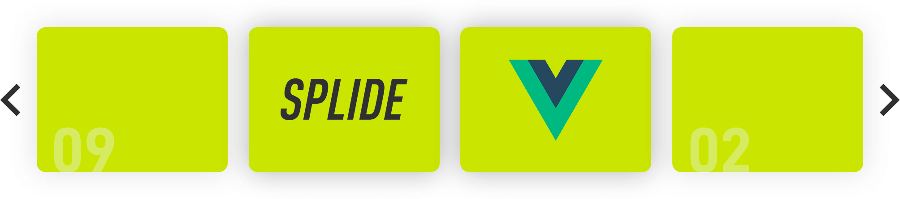

# Vue Splide
<p class="center">
    
</p>

**[Vue](https://vuejs.org/) component for the [Splide](https://github.com/Splidejs/splide) slider library.**
* [Document](https://splidejs.com/integration-vue-splide/)
* [Splide](https://github.com/Splidejs/splide)

## Installation
Get the latest version by NPM:
```bash
$ npm install @splidejs/vue-splide
```

## Registration
### Global Registration
Import vue-splide and install into Vue:
```javascript
import Vue from 'vue';
import App from './App';
import VueSplide from '@splidejs/vue-splide';

Vue.use( VueSplide );

new Vue( {
  el    : '#app',
  render: h => h( App ),
} );
```

### Local Registration
Import Splide and SplideSlide components:
```javascript
import { Splide, SplideSlide } from '@splidejs/vue-splide';

export default {
  components: {
    Splide,
    SplideSlide,
  },
}
```

### CSS
Import [styles](https://splidejs.com/themes/) if you need.
```javascript
import '@splidejs/splide/dist/css/themes/splide-default.min.css';
// or
import '@splidejs/splide/dist/css/themes/splide-sea-green.min.css';
// or
import '@splidejs/splide/dist/css/themes/splide-skyblue.min.css';
```

## Examples
Here is a small example:
```javascript
<template>
  <splide :options="options">
    <splide-slide>
      
    </splide-slide>
    <splide-slide>
      
    </splide-slide>
    <splide-slide>
      
    </splide-slide>
  </splide>
</template>

<script>
  export default { 
    data() {
      return {
        options: {
          rewind : true,
          width  : 800,
          gap    : '1rem',
        },
      };
    },
  }
</script>
```
More examples:
* [Basic example](https://github.com/Splidejs/vue-splide/blob/master/src/js/examples/components/BasicExample.vue)
* [Autoplay](https://github.com/Splidejs/vue-splide/blob/master/src/js/examples/components/AutoplayExample.vue)
* [Thumbnails](https://github.com/Splidejs/vue-splide/blob/master/src/js/examples/components/ThumbnailsExample.vue)
* [Dynamic slides](https://github.com/Splidejs/vue-splide/blob/master/src/js/examples/components/DynamicSlidesExample.vue)

## License
Vue Splide and Splide are released under the MIT license.  
© 2020 Naotoshi Fujita